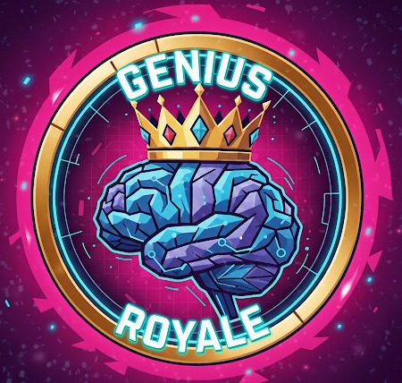

  
  <h1>🧠👑 Genius Royale</h1>
  
<em>Plataforma competitiva de Trivia en Tiempo Real de alta disponibilidad y tolerancia a fallos.</em>

  
  
  
  

 

## 🚀 Acceso y Pruebas (Demo en Vivo)

**⚠️ IMPORTANTE SOBRE EL ARRANQUE (COLD START):** Esta aplicación está desplegada en un entorno de nube gratuito. Si la aplicación no ha recibido tráfico recientemente, la instancia entra en modo reposo (*sleep*). **Al hacer clic en el enlace por primera vez, es posible que tarde entre 30 y 60 segundos en arrancar el servidor backend.** Una vez que la máquina "despierta", la navegación y los WebSockets funcionarán a la velocidad de la luz.

Para facilitar la prueba técnica sin necesidad de crear una cuenta nueva, puedes utilizar las siguientes credenciales de pruebas:
* **Usuario:** `b`
* **Contraseña:** `b`
* Enlace aplicacion web desplegada: https://geniusroyale.vercel.app/

---

## 🏗️ Visión General

**Genius Royale** no es solo un juego de preguntas; es una demostración técnica de arquitectura de sistemas distribuidos y comunicación bidireccional en tiempo real. 

Construido bajo el paradigma de Single Page Application (SPA) y un backend robusto en Spring Boot, el sistema maneja sincronización milimétrica de clientes, sistemas complejos de salas y *matchmaking*, y una tolerancia a interrupciones extrema mediante rehidratación de estado.

## ✨ Características Técnicas Destacadas

### ⚡ Comunicación Bidireccional de Baja Latencia
Infraestructura completa de **WebSockets (sobre SockJS y STOMP)** que reemplaza el *polling* tradicional. Permite mensajería instantánea distribuida en canales (*topics*):
* **Chats Aislados:** Canales globales, chats privados "Peer-to-Peer" y chats cerrados por sala.
* **Eventos de Juego en Vivo:** Sincronización de respuestas de rivales, uso de comodines disruptivos (Bombas, Cambio) y eventos de eliminación (Muerte Súbita) retransmitidos en milisegundos.

### 🛡️ Rehidratación de Estado Defensiva (F5-Proof)
El frontend cuenta con un ciclo de vida diseñado para la resiliencia. Un motor de caché local acoplado con respuestas de sincronización del servidor permite la **recuperación instantánea de partidas en curso**.
* Tolerancia total a recargas del navegador (F5), caídas de red o cierres accidentales.
* Sincronización milimétrica de temporizadores, estado de UI y persistencia de comodines sin pérdida de progreso de la sesión de juego.

### 🎮 Matchmaking y Gestión de Salas Dinámica
Controlador de *Lobbies* concurrente gestionado en memoria RAM para latencia cero antes de la persistencia en base de datos.
* **Modos Públicos:** Algoritmos de emparejamiento para duelos 1v1 y *Battle Royale* masivos.
* **Salas Privadas:** Sistema de invitaciones directas P2P, gestión de privilegios de Host (kick, configuración) y motores de votación en tiempo real con temporizador concurrente para selección de categorías.
* **Modo PIN (Estilo Kahoot):** Inyección de partidas rápidas para usuarios invitados (Guests) mediante códigos de sala numéricos de un solo uso.

### 🎲 Motores de Resolución de Lógica
El servidor delega la carga crítica de negocio de forma eficiente:
* Generación procedural de rondas balanceando dificultades (Fácil, Intermedia, Difícil).
* Motor de desempate automatizado mediante un algoritmo de "tirada de dados" (*RNG*) sincronizado en el frontend.
* Transiciones automáticas de "Jugador" a "Modo Espectador" interactivas.

## 🛠️ Stack Tecnológico

### Backend
* **Java 17 / Spring Boot:** Arquitectura REST y gestión del ciclo de vida de la aplicación.
* **Spring WebSockets:** Protocolo STOMP para subscripción a colas de mensajería (Pub/Sub).
* **Spring Data JPA & Hibernate:** ORM para la persistencia estructural.
* **PostgreSQL:** Almacenamiento relacional de usuarios, categorías, batería masiva de preguntas y registro de invitaciones.

### Frontend
* **Vanilla JavaScript (ES6+):** Arquitectura SPA pura basada en mutación del DOM y enrutamiento por *hash*, sin frameworks pesados. Carga asíncrona optimizada.
* **HTML5 / CSS3:** Interfaces cinemáticas (*flexbox/grid*), diseños responsivos y animaciones fluidas mediante *keyframes*.
* **SockJS & Stomp.js:** Clientes para el mantenimiento del socket bidireccional.

## ⚙️ Flujo de Arquitectura

El sistema utiliza un **Controlador de Juego Central (GameLobbyController)** concurrente en Java que mapea mensajes STOMP hacia hilos manejadores específicos. Al iniciar una partida, la sala virtual (*Lobby*) muta a una entidad de persistencia real en PostgreSQL, generando un UUID único y construyendo el árbol de preguntas. 

El frontend, utilizando un interceptor en el evento `DOMContentLoaded`, evalúa constantemente si debe renderizar una interfaz de autenticación o inyectar un *overlay* de **Sincronización Bloqueante** para exigir el estado vivo al backend.
