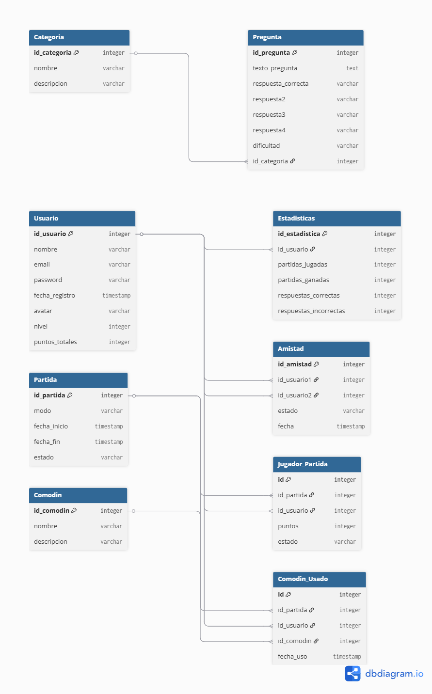

# Diseño de Base de Datos – Genius Royale

## Descripción general

La base de datos almacena toda la información necesaria para el funcionamiento del juego **Genius Royale**, incluyendo usuarios, partidas, preguntas, categorías, comodines y estadísticas de los jugadores.

## Entidades principales

- Usuario
- Pregunta
- Categoria
- Partida
- Jugador_Partida
- Estadisticas
- Amistad
- Comodin
- Comodin_Usado

## Descripción de las entidades

### Usuario
Almacena la información de los jugadores registrados en la aplicación, como su nombre, correo electrónico, contraseña, nivel y puntos acumulados.

### Pregunta
Contiene las preguntas que se utilizan durante las partidas del juego, incluyendo sus posibles respuestas y la dificultad.

### Categoria
Permite clasificar las preguntas según su temática, por ejemplo fútbol, videojuegos o cultura general.

### Partida
Representa una partida del juego en la que participan uno o varios jugadores.

### Jugador_Partida
Relaciona los jugadores con las partidas en las que participan y almacena información relevante como los puntos obtenidos o el estado del jugador en la partida.

### Estadisticas
Guarda estadísticas globales de cada jugador, como número de partidas jugadas, partidas ganadas o número de respuestas correctas e incorrectas.

### Amistad
Representa las relaciones de amistad entre los usuarios del sistema, permitiendo añadir amigos y jugar partidas privadas.

### Comodin
Almacena los distintos comodines disponibles en el juego, como el 50:50 o cambiar de pregunta.

### Comodin_Usado
Registra cuándo un jugador utiliza un comodín durante una partida.
## Diagrama de la base de datos

